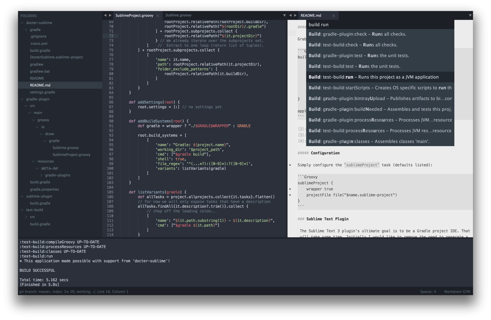
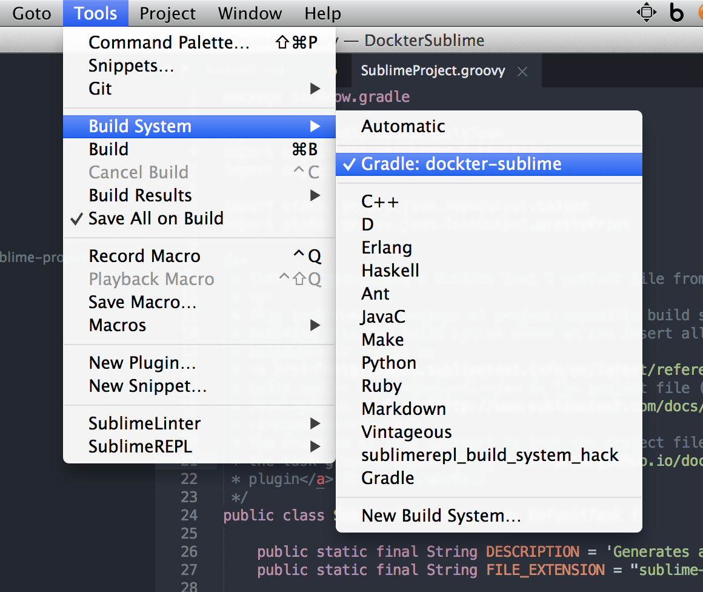

# Dockter Sublime

Tools for developing Gradle projects using Sublime Text 3.



### Gradle Plugin

[![Build Status][2]][1] 

[1]: https://travis-ci.org/dcow/dockter-sublime
[2]: https://travis-ci.org/dcow/dockter-sublime.svg?branch=master

Applying the `sublime` plugin adds a task named `sublime` to your Gradle project. Executing the task causes a *sublime-project* file to be generated with configuration inforamtion relevant to Sublime Text. The project description is complete with an inline Sublime *build system*. This means all your project's tasks will be available via the command palette.

The drawback of this approach is that updating your project is not fluid. Sublime Text stores your latest configuration in a *sublime-workspace* file. Sublime also [seems to have issues reloading project information][3]. So, ideally we need a Sublime Text plugin that will *dynamically update the editor whenever a build script change is made*.

A Sublime Text plugin does not obselete a Gradle plugin. The plugin also configures Sublime with the names and paths of your Gradle subprojects and excludes your projects' build directories. In fact, it allows you to configure any arbitrary project-specific Sublime Text setting. 

[3]: https://www.sublimetext.com/forum/viewtopic.php?f=2&t=5342#p37042 

##### Setup

Grab the [lastest version][4] ([0.9.2][5]) from [jcenter][6]:

```Groovy
buildscript {
    repositories {
        jcenter()
    }
    dependencies {
        classpath 'io.dcow.gradle:sublime:0.9.+'
    }
}

apply plugin: 'io.dcow.sublime'
```

[4]: https://bintray.com/dcow/maven/sublime/view
[5]: https://bintray.com/dcow/maven/sublime/0.9.2/view
[6]: https://bintray.com/bintray/jcenter

##### Configuration

Simply configure the `sublime` extension (defaults listed):

```Groovy
sublime {
    wrapper true
    name project.name
    settings [:] 
}
```

##### Usage 

The plugin actually creates 3 tasks:

1. `sublimeProject`
2. `clearWorkspace`, and
3. `sublime`

(which get executed in their respective order). Most of the time all you need to do is execute the `sublime` task.

    $ gradle sublime

This generates a `${sublime.name}.sublime-project` file in your root project directory and deletes the associated `.sublime-workspace` file (because it contains stale information).

Once the project file is generated, using the Sublime Text **Project** menu, open the newly generated file via the **Open Project** option (be aware you may have to close your current project first). When you open the project you should see the sidebar come up with your logical Gradle module structure (unless you've otherwise configured your project settings). If it doesn't you may have to entirely quit Sublime and try from a fresh launch. 

After you open the project you may have to select the build system.



And that's it. You can now execute all the project's `gradle` tasks that *have a description* from the command pallete.

One more thing. When working with projects in Sublime, I find disabling `hot_exit` and `remember_open_files` useful since everything gets saved in your project workspace:

```json
{
    "hot_exit": false,
    "remember_open_files": false
}
```

### Sublime Text Plugin

 The Sublime Text 3 plugin's ultimate goal is to be a Gradle project IDE. That will take some time. Initially I would like to remove the need to generate a static build system description by dynamically adding commands to Sublime.

 Then lint, code completion, and *maybe* debugging.
